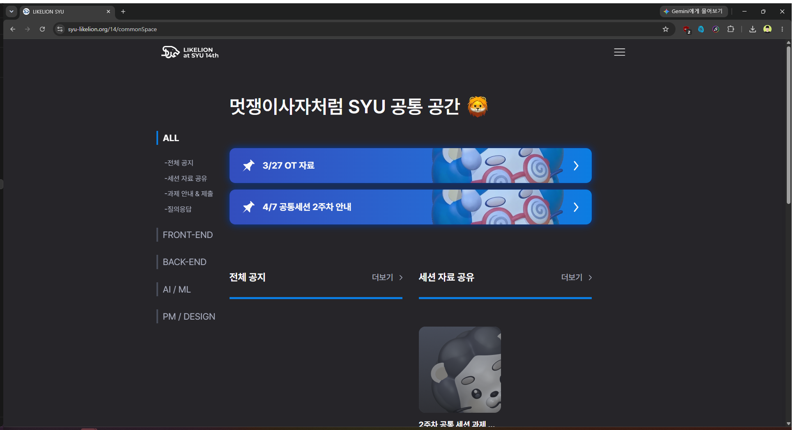
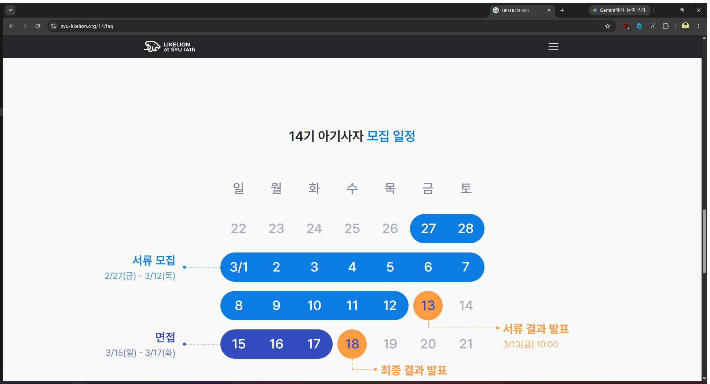
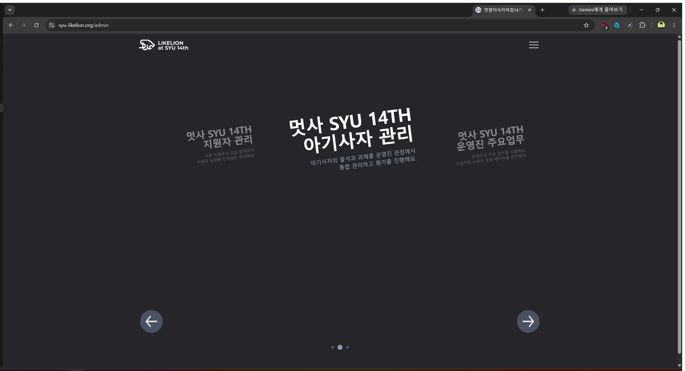
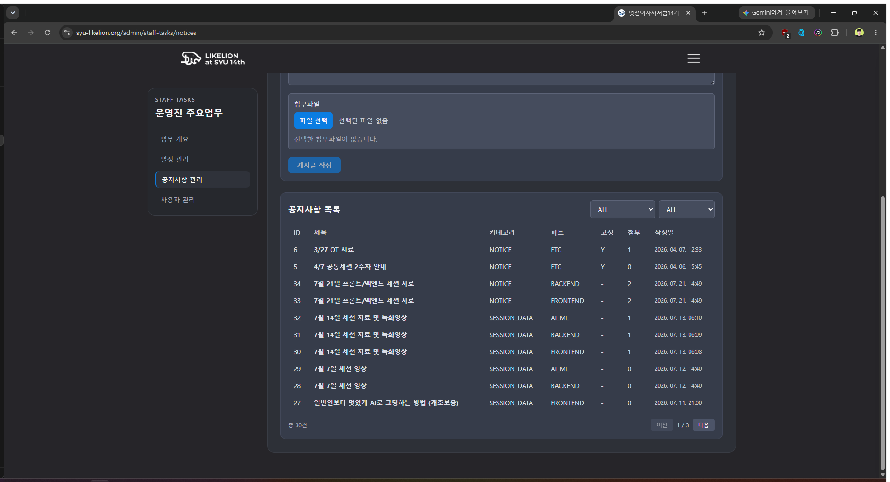
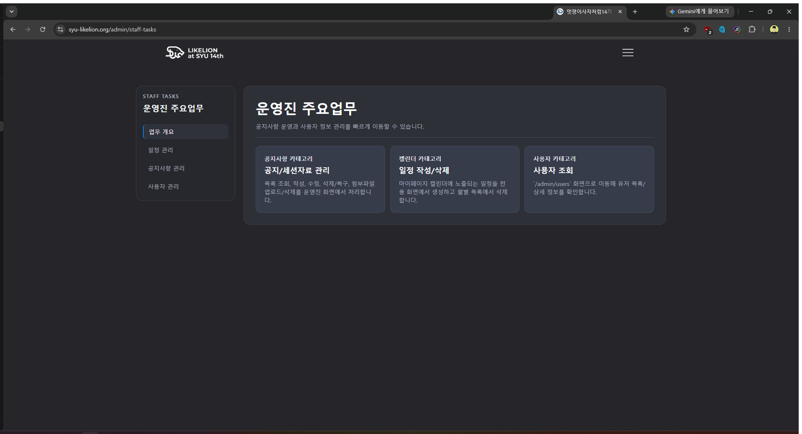
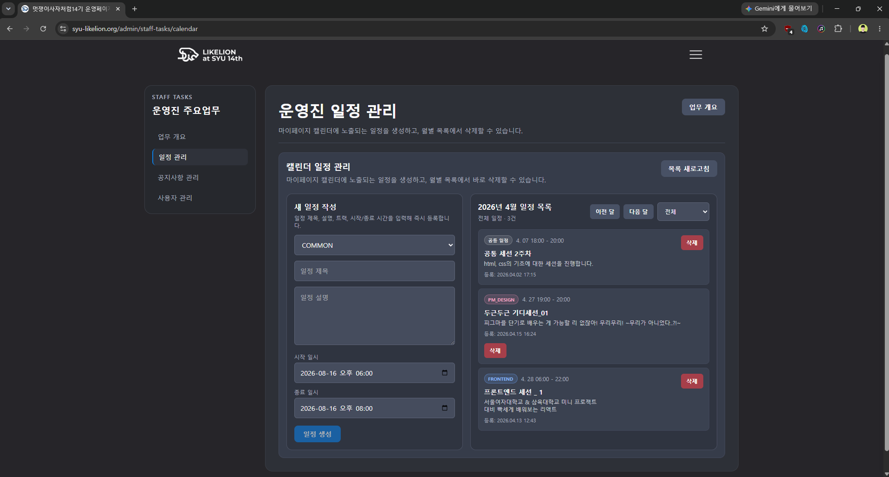
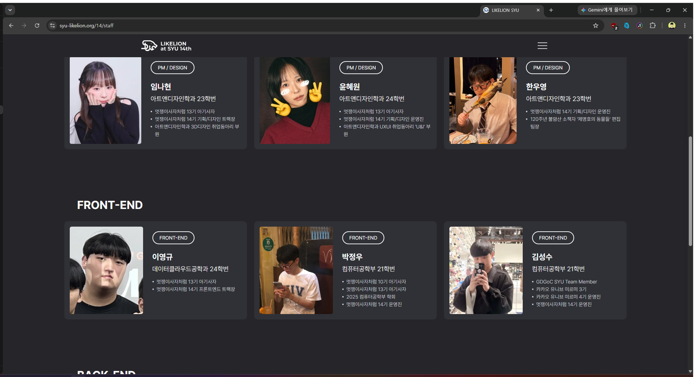

# syu-likelion 포트폴리오 콘텐츠 점검

점검일: 2026-08-16  
반영일: 2026-08-16  
대상: [운영 사이트](https://syu-likelion.org/) · [공통 공간](https://syu-likelion.org/14/commonSpace) · [공개 GitHub 저장소](https://github.com/No4hh4oN/Likelion14th-FE) · 현재 포트폴리오 Case Study

## 반영 상태

이 문서의 권고는 [syu-likelion.ts](../../src/data/caseStudies/syu-likelion.ts)에 반영되었다. 반영 과정에서 이 문서가 놓친 제약 네 가지를 확인했고, 그 부분은 권고와 다르게 처리했다.

### 1. Case Study 이미지는 16:10으로 강제 크롭된다

[CaseSection.tsx](../../src/components/project/CaseSection.tsx)의 `image` 블록은 `aspect-16/10` 컨테이너에 `object-cover`로 렌더된다. 즉 세로가 긴 캡처는 원본의 일부만 보인다.

| 이미지 | 원본 비율 | 16:10에서 보이는 세로 |
| --- | --- | --- |
| `application-submitted.png` | 1.54 | 96% |
| `first-result-interview.png` | 0.72 | 45% |
| `final-result-pass.png` | 0.83 | 52% |
| `syu-likelion-mypage.png` | 0.91 | 57% |
| `application-form.png` | 0.46 | 29% |

따라서 `position` 값으로 "무엇을 살릴지"를 이미지마다 지정해야 한다. 반영본에서는 `first-result-interview.png`에 `center 40%`를 주어 1차 합격 안내와 면접 날짜·시간 선택 영역이 함께 들어오게 했고, `syu-likelion-mypage.png`에는 `center 88%`를 주어 캘린더와 일정·과제 패널을 살렸다. 두 값 모두 실제 크롭 결과를 렌더해 확인했다.

### 2. `final-result-pass.png`는 현재 상태로 쓸 수 없다

이 문서는 "사용"으로 판단했으나, 화면 안에 미완성 문구가 남아 있다.

> 위치 : 위치 나오면 수정

16:10 크롭에서 최종 합격 메시지를 살리면 이 문구가 반드시 같이 들어온다. 포트폴리오 대표 컷에 개발 중 placeholder를 노출하게 되므로 **이미지 사용을 보류하고 최종 합격 흐름은 문장으로만 서술**했다. QR 코드 노출 문제도 함께 해소된다.

사용하려면 OT 위치가 확정된 화면으로 다시 촬영해야 한다.

### 3. 개인정보 위험은 낮다 — 결과 화면도 샘플 계정이다

이 문서는 마이페이지만 샘플 데이터로 판단했으나, `first-result-interview.png`와 `final-result-pass.png`에 나오는 이름도 마이페이지와 동일한 샘플 계정이다. 세 화면 모두 실사용자 정보가 아니다.

다만 마이페이지의 "내가 쓴 글" 제목이 농담성 샘플 문구라 채용 담당자가 읽는 화면으로는 어울리지 않는다. `center bottom` 크롭으로 노출을 줄였지만, 중립적인 제목으로 다시 촬영하는 편이 낫다.

### 4. 구조·문구 권고 중 상위 문서와 충돌하는 것

- **섹션 재배치**: AGENTS.md §43이 `Overview → Problem → Existing Workflow → Solution → My Contribution → Recruitment Admin Flow → Frontend / Backend Collaboration → Problems & Improvements → Result → Retrospective` 순서를 Case Study Design System의 기준으로 고정한다. 이 문서가 제안한 재배치는 `Problems & Improvements`(decision 블록이 들어 있는 §21의 핵심 섹션)를 없애므로 채택하지 않았다. 대신 §43 순서를 유지한 채 `06 Applicant Flow`와 `08 After Recruitment` 두 섹션을 삽입해 12개 섹션으로 만들었다.
- **Hero 문구**: 이 문서가 제안한 확장 메시지(32자)는 Hero의 `max-w-[18ch]` 제약을 넘고, 카드 문구는 AGENTS.md §36이 고정한다. headline은 그대로 두고 `summary`를 수명주기 문장으로 확장했다.
- **`artifacts/`의 캡처 7장**: `public/` 밖에 있어 Case Study에서 참조할 수 없다. `07-common-space.png`는 브라우저 크롬과 개인 프로필 아이콘까지 들어 있어 그대로는 쓸 수 없다. 공통 공간 내용은 문장과 list 블록으로만 서술했다.

### 파일명 정리

`public/images/` 나머지가 모두 ASCII kebab-case였으므로 새 캡처도 맞췄다. 아래 링크는 모두 변경 후 경로다.

| 이전 | 이후 |
| --- | --- |
| `마이페이지 -_ 내활동.png` | `syu-likelion-mypage.png` |
| `apply/지원서 작성.png` | `apply/application-form.png` |
| `apply/지원서 작성완료.png` | `apply/application-submitted.png` |
| `apply/1차 결과발표.png` | `apply/first-result-cta.png` |
| `apply/지원서 1차 결과발표.png` | `apply/first-result-interview.png` |
| `apply/최종결과발표 - 합격.png` | `apply/final-result-pass.png` |

## 결론

현재 Case Study의 강점은 **지원자 조회·서류 평가·면접·합격 관리라는 복잡한 운영자 Flow**다. 여기에 박정우가 직접 구현한 지원자 상태 UX와 모집 이후 운영 기능을 더하면 프로젝트의 범위를 훨씬 정확하게 보여줄 수 있다.

기존 메시지:

> 분산된 동아리 운영을 하나로

추천 확장 메시지:

> 모집 공고와 지원서 제출부터 서류·면접 평가, 합격 후 공지·세션 자료·과제·일정 운영까지 하나의 서비스로 연결했습니다.

이 프로젝트는 단순한 모집 랜딩 페이지나 관리자 CRUD가 아니다. **지원자가 동아리원이 되고, 운영진이 그 과정을 계속 관리하는 전체 수명주기를 연결한 운영 플랫폼**으로 설명하는 것이 가장 적절하다.

## 실제 서비스에서 확인한 제품 구조

| 사용자 | 확인한 흐름 | 포트폴리오에서 보여줄 가치 |
| --- | --- | --- |
| 지원자 | 모집 정보·일정 확인 → 지원서 작성·제출 → 결과 확인 → 면접 시간 예약 | 단계별 상태와 다음 행동을 연결한 UX |
| 동아리원 | 공통 공간 → 공지·세션 자료·과제·질의응답 → 마이페이지의 활동·과제·일정 확인 | 모집 이후에도 계속 사용되는 서비스 |
| 운영진 | 지원자 평가·합격 관리 → 과제 제출 현황·평가 → 공지·자료·일정·사용자 관리 | 실제 업무를 한 화면 체계로 통합한 운영자 UX |

운영자 진입 화면은 제품 범위를 세 영역으로 나눈다.

1. 지원자 관리: 서류 지원부터 최종 합격까지
2. 아기사자 관리: 과제·제출·평가·출결
3. 운영진 주요 업무: 공지·세션 자료·일정·사용자 관리

출결 관리는 서비스 전체 범위에는 포함되지만 박정우의 개인 기여는 아니다. Case Study에서는 `서비스가 제공하는 기능`과 `내가 설계·구현한 범위`를 분리해 표기해야 한다.

## 확정된 박정우 개인 기여

다음 항목은 개인 기여로 명시할 수 있다.

- 지원서 임시 저장
- 제출 완료 후 지원서 수정
- 지원서 파일 업로드
- 결과 상태별 화면
- 서류 합격자의 면접 시간 선택·예약
- 활성 역할을 확인하는 `STAFF` 기반 Admin Guard
- 공지·세션 자료 관리
- 운영 일정 관리와 마이페이지 캘린더 연결
- 과제 제출 현황 조회·평가

개인 기여가 아닌 항목:

- 출결 관리

추천 표기:

> 서비스에는 지원자 관리, 과제, 출결, 공지, 세션 자료, 일정 기능이 포함됩니다. 이 중 지원서 작성·결과 확인·면접 예약, 운영진 권한 처리, 공지·자료·일정 관리, 과제 제출 현황·평가를 담당했습니다.

## 우선 추가할 내용

### 1. 모집에서 운영으로 이어지는 수명주기

현재 글은 모집 Flow에서 대부분 끝난다. 다음 내용을 `Solution` 뒤 또는 `Recruitment Admin Flow` 다음에 추가하는 것이 가장 효과적이다.

> 모집 도구를 만드는 데서 멈추지 않았습니다. 합격자가 같은 계정과 역할을 유지한 채 공통 공간, 공지, 세션 자료, 과제, 일정으로 이어지도록 모집 이후의 운영까지 하나의 서비스 안에 연결했습니다.

추천 Flow:

```text
모집 안내
→ 지원서 임시 저장·제출
→ 서류 평가
→ 결과 확인·면접 시간 예약
→ 면접 평가·최종 합격
→ 동아리원 역할 전환
→ 공지·자료·과제·질의응답·일정 이용
```

### 2. 하나의 서비스, 세 사용자

현재 `지원자 화면 / 운영진 화면`의 2분법을 아래처럼 3개 Journey로 구체화하면 제품 사고가 더 잘 보인다.

```text
Applicant
모집 정보 → 지원서 → 1차 결과 → 면접 예약 → 최종 결과

Member
공통 공간 → 공지·자료 → 과제 제출·평가 확인 → 마이페이지 일정

Staff
지원자 평가 → 합격 관리 → 과제 평가 → 콘텐츠·일정 관리
```

각 기능을 나열하기보다, 같은 모집 데이터와 사용자 역할이 다음 단계의 행동으로 어떻게 이어지는지를 설명한다.

### 3. 지원 과정의 상태 설계

박정우가 직접 구현한 지원자 Flow는 다음과 같다.

- 지원서 최초 생성과 임시 저장
- 임시 저장 지원서 수정
- 제출 완료 지원서 수정
- 파일 업로드
- 최종 제출과 지원 취소
- 서류 합격자용 면접 시간 선택·예약
- 결과 상태별 안내 화면

추천 서술:

> 지원서는 한 번에 작성되는 문서가 아니기 때문에 임시 저장과 제출 상태를 분리했습니다. 제출 이후에도 발표 전까지 수정할 수 있도록 하되, 1차 결과 발표 이후에는 수정할 수 없다는 상태 경계를 화면에서 명확히 안내했습니다.

> 결과 화면은 단순히 합격 여부만 보여주지 않습니다. 서류 합격자는 날짜와 시간을 선택해 면접을 예약하고, 최종 합격자는 OT 일정과 다음 커뮤니티 채널까지 확인할 수 있도록 다음 행동을 연결했습니다.

이 내용은 `지원서 작성완료`와 `지원서 1차 결과발표` 이미지로 직접 증명할 수 있다.

### 4. 공통 공간 — 모집 이후 실제 사용

올바른 운영 경로는 `/14/commonSpace`다. 실제 화면에서 다음 구조를 확인했다.

- 트랙 필터: ALL, FRONT-END, BACK-END, AI / ML, PM / DESIGN
- 콘텐츠 구분: 전체 공지, 세션 자료 공유, 과제 안내 & 제출, 질의응답
- 홈에서 주요 공지와 최신 세션 자료 요약
- 과제 마감일과 제출 상태 표시
- 제출 파일 확인
- 평가 대기 및 평가 결과 확인
- 제출 취소

추천 서술:

> 합격 이후 필요한 공지, 세션 자료, 과제, 질의응답을 하나의 공통 공간에 모았습니다. 사용자는 전체 콘텐츠와 자신의 트랙 콘텐츠를 구분해 보고, 과제 카드 안에서 마감일·제출 파일·평가 상태를 이어서 확인할 수 있습니다.

이 화면은 “모집이 끝난 뒤에도 실제로 사용되는 서비스”라는 주장을 가장 직접적으로 증명한다.

### 5. 모집 이후의 운영자 UX

실제 운영 화면에서는 다음 기능을 확인했다.

- 공지·세션 자료 생성, 수정, 삭제, 복원
- 트랙·콘텐츠 유형·고정 여부·첨부파일 관리
- 운영 일정 생성과 마이페이지 캘린더 반영
- 과제 생성·수정·제출 현황·평가
- 날짜·트랙별 출결 상태 관리
- 사용자 목록·상세 조회

박정우의 개인 기여는 공지·세션 자료·일정 관리와 과제 제출 현황·평가다. 출결 관리는 다른 팀원의 기여이므로 개인 구현 목록에서는 제외한다.

추천 서술:

> 운영진이 등록한 일정은 동아리원의 마이페이지 캘린더에 반영되고, 공지와 세션 자료는 유형·트랙·고정 여부·첨부파일 기준으로 관리됩니다. 과제는 제출 여부뿐 아니라 제출 파일과 평가 상태까지 한 흐름에서 확인할 수 있도록 구현했습니다.

### 6. 역할 기반 접근 제어

운영진 메뉴는 로그인 여부만이 아니라 활성 역할의 `STAFF` 권한을 확인한 뒤 노출된다. 이 Guard는 박정우의 개인 기여다.

추천 서술:

> 같은 계정을 사용하더라도 활성 역할에 따라 접근 가능한 화면과 수행할 수 있는 업무를 구분했습니다. 프론트엔드에서는 활성 역할의 `STAFF` 여부를 확인해 운영진 화면 접근을 제어하고, 인증 정보가 없거나 권한이 부족하면 각 상태에 맞는 화면으로 이동시켰습니다.

서버 측 권한 검증 범위는 별개의 영역이므로 프론트엔드 Guard만으로 전체 보안을 완성했다고 표현하지 않는다.

## 추천 Case Study 구조

현재 10개 섹션을 크게 늘리지 않고 다음처럼 재배치하는 것이 좋다.

1. Overview — 모집부터 교육 운영까지 이어지는 플랫폼
2. Problem — Discord·KakaoTalk·Google Forms·Excel에 분산된 정보와 판단
3. Existing Workflow — 운영진의 실제 업무 단절
4. Product Scope — Applicant / Member / Staff 세 Journey
5. My Contribution — 확정된 개인 기여와 비기여 범위
6. Recruitment Flow — 임시 저장·제출·결과·면접 예약과 운영진 평가
7. After Recruitment — 공통 공간·과제·공지·자료·일정
8. Technical Collaboration — API 계약 불일치와 역할·상태 처리
9. Result — 148명·64명·200회·30건과 실제 운영
10. Retrospective — 운영 도구를 먼저 설계했어야 했다는 학습

핵심은 `Solution`을 **세 역할의 연결**, `Result`를 **모집 이후 실제 사용**, `My Contribution`을 **검증된 담당 범위**로 바꾸는 것이다.

## 스크린샷 선정

### 지원·결과 이미지 5장 검토 결과

| 이미지 | 판단 | 이유 |
| --- | --- | --- |
| `application-form.png` | 보조 또는 재촬영 | 임시 저장·파일 업로드가 한 화면에 보여 기능 증명에는 좋지만 세로가 매우 길고, 선택된 트랙과 예시 질문이 어긋나 보이는 부분이 있어 대표 컷에는 부적합 |
| `application-submitted.png` | 사용 | 제출 완료, 발표 일정, 수정 가능 상태, 지원 취소를 한 화면에서 보여줌 |
| `first-result-cta.png` | 제외 | 결과 확인 전 CTA 화면이라 정보량이 적고 다음 이미지와 메시지가 겹침 |
| `first-result-interview.png` | 핵심 사용 | 합격 상태와 면접 날짜·시간 선택을 함께 보여주는 가장 강한 Product Decision 화면 |
| `final-result-pass.png` | ~~사용~~ → **보류** | 최종 합격에서 OT와 커뮤니티 채널로 이어지는 전환을 보여주지만, 화면에 "위치 : 위치 나오면 수정" placeholder가 남아 있다. 위 [반영 상태 2](#2-final-result-passpng는-현재-상태로-쓸-수-없다) 참고 |

### 1. 지원서 제출 완료와 수정 가능 상태

[원본 열기](<../../public/images/projects/apply/application-submitted.png>)


- 증명하는 것: 제출 완료 상태, 발표 일정, 제출 후 수정, 지원 취소
- 추천 위치: `Recruitment Flow`의 지원자 Journey 시작
- 추천 캡션: “제출 완료 여부와 이후 일정을 안내하고, 결과 발표 전까지 수정할 수 있는 상태 경계를 명확히 했습니다.”

### 2. 1차 합격과 면접 시간 예약

[원본 열기](<../../public/images/projects/apply/first-result-interview.png>)


- 증명하는 것: 결과 확인에서 다음 행동인 면접 예약까지 연결된 UX
- 추천 위치: `Recruitment Flow`의 대표 이미지
- 추천 캡션: “서류 합격자가 별도의 연락 없이 가능한 날짜와 시간을 확인하고 면접 일정을 확정하도록 구현했습니다.”

### 3. 최종 합격 이후의 다음 행동

[원본 열기](<../../public/images/projects/apply/final-result-pass.png>)


- 증명하는 것: 최종 합격에서 OT와 커뮤니티 진입까지 연결되는 전환
- 추천 위치: `Recruitment Flow` 마지막 또는 `After Recruitment` 도입부
- 공개 전 처리: QR 코드가 실제 초대 링크로 동작한다면 블러하거나 만료된 샘플 QR로 교체
- 추천 캡션: “최종 합격자가 OT 일정과 다음 커뮤니티 채널을 바로 확인할 수 있도록 후속 행동을 연결했습니다.”
- **반영 시 보류**: 16:10 크롭에서 최종 합격 메시지를 살리면 "위치 : 위치 나오면 수정" placeholder가 반드시 함께 들어온다. OT 위치가 확정된 화면으로 재촬영하기 전까지는 쓰지 않는다. Case Study에서는 최종 합격 흐름을 문장으로만 서술했다

### 4. 샘플 데이터 마이페이지

[원본 열기](<../../public/images/projects/syu-likelion-mypage.png>)


- 증명하는 것: 내가 쓴 글, 일정, 세션, 과제 마감 정보를 한 화면에서 확인하는 동아리원 경험
- 추천 위치: `After Recruitment`의 대표 이미지
- 공개 가능성: 샘플 데이터로 제작되어 실사용자 개인정보 노출 위험이 낮음
- 추천 캡션: “동아리원은 자신의 활동과 세션 일정, 과제 마감일을 마이페이지에서 한 번에 확인합니다.”

### 5. 공통 공간

[원본 열기](./07-common-space.png)



- 증명하는 것: 공지·세션 자료·과제·질의응답과 트랙 필터가 실제로 연결된 모집 이후 서비스
- 추천 위치: `After Recruitment`에서 마이페이지 이미지와 나란히 배치
- 공개 전 처리: 현재 캡처에는 실제 제출 파일명과 상태가 있으므로 포트폴리오용 샘플 계정 화면으로 다시 촬영하는 것이 안전함
- 추천 캡션: “전체 콘텐츠와 트랙별 콘텐츠를 구분하고, 과제 제출 파일과 평가 상태까지 공통 공간에서 이어서 확인합니다.”

### 6. 모집 일정

[원본 열기](./01-recruitment-schedule.png)



- 증명하는 것: 서류 모집·서류 발표·면접·최종 발표로 이어지는 단계형 과정
- 추천 위치: `Product Scope` 또는 `Recruitment Flow` 도입부의 보조 이미지
- 추천 캡션: “지원자에게도 운영진과 동일한 모집 단계를 날짜 중심으로 안내했습니다.”

### 7. 운영자 제품 영역

[원본 열기](./02-admin-product-domains.png)



- 증명하는 것: 지원자 관리에서 끝나지 않고 아기사자·운영진 업무까지 확장된 제품 범위
- 추천 위치: `Product Scope`의 대표 이미지 또는 세 Journey 다이어그램의 보조 이미지
- 추천 캡션: “운영 업무를 지원자 관리, 아기사자 관리, 운영진 주요 업무의 세 영역으로 나눴습니다.”

### 운영자 화면 보조 후보

#### 공지·세션 자료 운영

[원본 열기](./04-notice-session-operations.png)



- 30건의 실제 운영 콘텐츠가 등록된 서비스라는 점을 증명
- 내부 제목 공개가 가능하므로 사용할 수 있지만, 마이페이지·공통 공간 이미지와 메시지가 겹치면 생략

#### 운영진 주요 업무 개요

[원본 열기](./03-staff-operations-overview.png)



- 공지·일정·사용자 관리의 범위를 설명하기 좋음
- `운영자 제품 영역`과 메시지가 겹치므로 둘 중 하나만 대형 이미지로 사용

#### 일정 생성과 사용자 캘린더 연결

[원본 열기](./05-calendar-management.png)



- 운영진의 입력이 동아리원 마이페이지에 반영되는 Flow를 설명할 때 유용
- 현재 빈 상태이므로 샘플 일정이 있는 마이페이지 이미지와 한 쌍으로만 사용

#### 프론트엔드 운영진 구성

[원본 열기](./06-frontend-team.png)



- 협업 인원과 역할을 보조하는 용도
- 제품 판단을 보여주는 화면은 아니므로 우선순위가 낮음
- 팀원 사진을 포트폴리오에 재사용하기 전 공개 범위와 동의를 확인

## 최종 상세 페이지 이미지 조합

대형 스크린샷은 다음 7장 안에서 구성한다.

| 순서 | 이미지 | 역할 |
| --- | --- | --- |
| 1 | `syu-likelion.png` | 공개 랜딩과 지원 전환 |
| 2 | `application-submitted.png` | 제출 상태와 수정 가능 경계 |
| 3 | `first-result-interview.png` | 결과에서 면접 예약으로 이어지는 UX |
| 4 | `syu-likelion-admin.png` | 64명의 지원자와 단계별 목록·필터 |
| 5 | `syu-likelion-admin2.png` | 서류·점수·코멘트를 한 화면에서 비교하는 운영자 UX |
| 6 | ~~`final-result-pass.png`~~ | 합격 이후 OT·커뮤니티 전환 — placeholder 문구로 보류, 재촬영 후 투입 |
| 7 | `syu-likelion-mypage.png` | 모집 이후 실제 이용 경험 |

반영본은 위에서 6번을 뺀 **6장**으로 구성했다. `syu-likelion.png`(Solution) → `application-submitted.png`·`first-result-interview.png`(Applicant Flow) → `syu-likelion-admin.png`(Recruitment Admin Flow) → `syu-likelion-mypage.png`(After Recruitment) → `syu-likelion-admin2.png`(Problems & Improvements) 순서다.

페이지 길이가 길어지면 다음 기준으로 줄인다.

- 모집 일정은 Flow 다이어그램으로 대체 가능
- 운영자 제품 영역은 세 Journey 다이어그램으로 대체 가능
- 공지·세션 자료 관리 화면은 `30건` 수치와 마이페이지 화면이 충분하면 생략 가능
- 샘플 마이페이지와 공통 공간 중 하나만 대형으로 사용하고 다른 하나는 작은 보조 컷으로 배치

## 확정 성과

- 가입 사용자 148명
- 공식 지원자 64명
- 모집 기간 당일 최대 조회 수 200
- 2026-08-16 기준 공지·세션 자료 30건
- 실제 운영 및 유지보수 중

추천 Metric 구성:

```text
148
가입 사용자

64
공식 지원자

200
모집 당일 최대 조회

30
운영 중인 공지·세션 자료
```

숫자 네 개를 모두 같은 크기로 나열하기보다 `148 / 64 / 200`을 주요 성과로 두고, `공지·세션 자료 30건`은 모집 이후 운영을 설명하는 문장이나 이미지 캡션에 연결하는 편이 좋다.

반영: Result 섹션의 metrics 블록은 `148 / 64 / 200` 세 개, `30건`은 그 아래 문장에 넣었다. 네 수치는 AGENTS.md §9 성과와 §23 확인된 숫자 목록에도 추가해 두었다 — §39가 확인되지 않은 수치 사용을 금지하므로, 근거가 상위 문서에 남아 있어야 다음 작업에서 지워지지 않는다. `64`는 `syu-likelion-admin.png`의 "총 64명" 표시로 화면에서 직접 확인된다.

Hero와 홈 카드의 `project.metrics`는 `148 / 200` 두 개로 유지했다. 카드는 최대 2개 규칙이 있고, Hero와 배열을 공유한다.

## 운영 사이트에서 확인한 주의점

- 올바른 공통 공간 경로는 `/14/commonSpace`다. `/14/common-space`의 404는 잘못된 경로를 사용해 발생한 것이므로 기존 리스크 항목에서 제거했다.
- 지원서 작성 이미지는 세로가 길고 선택 트랙과 예시 질문이 어긋나 보이므로 그대로 대표 이미지로 사용하지 않는다.
- 최종 합격 이미지의 QR 코드가 실제 초대 링크라면 공개 전에 블러 또는 샘플 QR 교체가 필요하다. 다만 이 이미지는 placeholder 문구 때문에 어차피 보류했다.
- 최종 합격 이미지에 "위치 : 위치 나오면 수정"이라는 개발 중 placeholder가 남아 있다. 운영 사이트에서 이 문구가 아직 그대로라면 서비스 쪽에서도 고칠 항목이다.
- 실사용 마이페이지 대신 새로 제공된 샘플 데이터 이미지를 사용한다. 1차·최종 결과 화면에 나오는 이름도 같은 샘플 계정이므로 개인정보 위험은 없다.
- 마이페이지 샘플의 "내가 쓴 글" 제목이 농담성 문구다. 크롭으로 노출을 줄였지만 중립적인 제목으로 재촬영하는 편이 낫다.
- 출결 관리는 서비스 기능으로만 소개하고 박정우 개인 기여 목록에는 넣지 않는다.
- 공개 홈의 일부 후기 이미지는 접근성 트리에서 명확한 대체 이름이 확인되지 않았다. 포트폴리오에서 접근성을 강점으로 강조하려면 실제 alt 상태를 재점검한다.

## 바로 사용할 수 있는 문구

### 카드 한 줄

> 모집부터 교육 운영까지, 동아리의 한 학기를 하나의 플랫폼으로

### Overview

> Discord, KakaoTalk, Google Forms, Excel에 흩어져 있던 모집과 운영을 하나의 웹 서비스로 연결했습니다. 지원자는 지원서를 임시 저장하고 제출한 뒤 결과 확인과 면접 시간 선택까지 이어서 처리합니다. 합격 이후에는 공통 공간에서 공지, 세션 자료, 과제와 질의응답을 확인하고 마이페이지에서 자신의 활동과 일정을 관리합니다.

### My Contribution

> 지원서 임시 저장·제출 후 수정·파일 업로드, 결과 상태별 화면과 면접 시간 예약을 구현했습니다. 운영진 영역에서는 `STAFF` 역할 기반 접근 제어, 공지·세션 자료·일정 관리, 과제 제출 현황·평가를 담당했습니다. 출결 관리는 서비스 범위에는 포함되지만 제 담당 기능은 아닙니다.

### 핵심 Product Decision

> 결과 화면의 목적을 합격 여부 전달에만 두지 않았습니다. 서류 합격자는 가능한 면접 시간을 직접 선택하고, 최종 합격자는 OT와 커뮤니티로 이동하도록 각 상태에서 필요한 다음 행동을 연결했습니다.

### 모집 이후 운영

> 합격 이후 필요한 공지, 세션 자료, 과제와 질의응답을 트랙별로 구분해 제공했습니다. 사용자는 과제 마감일, 제출 파일, 평가 상태를 공통 공간에서 확인하고, 자신의 활동과 일정은 마이페이지에서 다시 모아볼 수 있습니다.

### Result

> 148명의 사용자가 가입했고 64명이 14기 모집에 지원했습니다. 모집 기간 당일 최대 조회 수 200을 기록했으며, 2026년 8월 기준 30건의 공지와 세션 자료가 등록된 실제 운영 서비스로 유지보수하고 있습니다.

